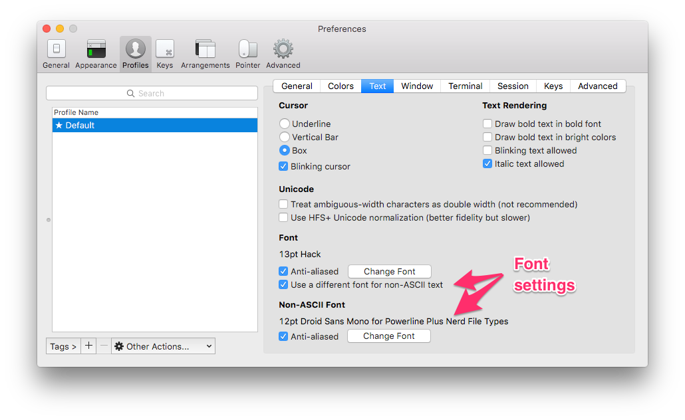

# dotfiles

This is a collection of my configs. Largely based on [this](https://github.com/nicknisi/dotfiles)


## Contents

+ [Initial Setup and Installation](#initial-setup-and-installation)
+ [ZSH Setup](#zsh-setup)
+ [Fonts](#fonts)

## Initial Setup and Installation

If on OSX, you will need to install the XCode CLI tools before continuing. To do so, open a terminal and type

```bash
xcode-select --install
```

Then, clone the dotfiles repository to your computer. This can be placed anywhere, and symbolic links will be created to reference it from your home directory.

```bash
git clone https://github.com/aleksandrpak/dotfiles.git ~/.dotfiles
cd ~/.dotfiles
sh install.sh
```

`install.sh` will start by initializing the submodules used by this repository. Then, it will install all symbolic links into your home directory. Every file with a `.symlink` extension will be symlinked to the home directory with a `.` in front of it. As an example, `zshrc.symlink` will be symlinked in the home directory as `~/.zshrc`. Then, this script will create a `~/.vim-tmp` directory in your home directory, as this is where vim is configured to place its temporary files. Additionally, all files in the `$DOTFILES/config` directory will be symlinked to the `~/.config/` directory for applications that follow the [XDG base directory specification](http://standards.freedesktop.org/basedir-spec/basedir-spec-latest.html), such as neovim.

Next, the install script will perform a check to see if it is running on an OSX machine. If so, it will install Homebrew if it is not currently installed and will install the homebrew packages listed in [`brew.sh`](install/brew.sh). Then, it will run [`osx.sh`](install/osx.sh) and change some OSX configurations. This file is pretty well documented and so it is advised that you __read through and comment out any changes you do not want__.

## ZSH Setup

ZSH is configured in the `zshrc.symlink` file, which will be symlinked to the home directory. The following occurs in this file:

* set the `EDITOR` to nvim
* Load any `~/.terminfo` setup
* Set the `CODE_DIR` variable, pointing to the location where the code projects exist for exclusive autocompletion with the `c` command
* Recursively search the `$DOTFILES/zsh` directory for files ending in .zsh and source them
* source a `~/.localrc` if it exists so that additional configurations can be made that won't be kept track of in this dotfiles repo. This is good for things like API keys, etc.
* Add the `~/bin` and `$DOTFILES/bin` directories to the path
* hub if it exists
* Set the base16 colorscheme to use for both the terminal (iTerm2) and vim/neovim by exporting the `$THEME` and `$BACKGROUND` environment variables
* And more...

## Fonts

I am currently using [Hack](http://sourcefoundry.org/hack/) as my default font, which does include Powerline support, so you don't need an additional patched font. In addition to this, I do have [nerd-fonts](https://github.com/ryanoasis/nerd-fonts) installed and configured to be used for non-ascii characters. If you would prefer not to do this, then simply remove the `Plug 'ryanoasis/vim-devicons'` plugin from vim/nvim. Then, I configure the fonts in this way in iTerm2:



## Things to automate in OSX

Some of the procedures are still required automation:

* System Preferences -> Keyboard -> Keyboard -> Use all F1, F2, etc. keys as standard function keys
* System Preferences -> Keyboard -> Input Sources -> Add Russian
* System Preferences -> Keyboard -> Shortcuts -> Input Sources: Command + Space
* System Preferences -> Keyboard -> Shortcuts -> Mission Control: Disable F11, F12
* System Preferences -> Desktop & Screen Saver -> Desktop -> Solid Colors -> Solid Gray Pro Ultra Dark
* System Preferences -> General -> Enable 'Use dark menu bar and Dock'
* System Preferences -> Notifications -> Do Not Disturb -> From 05:00 to 04:59
* Finder -> Preferences -> New Finder Window show: Downloads
* Install Taurine from AppStore
* Install Pocket from AppStore
* Install Wunderlist from AppStore
* Configure dock: Finder | iTerm | Firefox | iMessage | Calendar
* Launch iTerm: iTerm top menu -> Make iTerm2 default Term
* System Preferences -> Mission Control -> Disable Automatically rearrange Spaces based on most recent use
* System Preferences -> Dock -> Automatically hide and show the Dock
* System Preferences -> Keyboard -> Shortcuts -> Mission Control -> Enable shortcuts for desktops
* iTerm Preferences -> Profiles -> Window -> Style: No Title Bar
* add cargo clippy install
* amethyst settings
* iTerm2 -> Profiles -> Advanced -> Triggers -> pomo + ' ' + finished (Show alert, instant)
* Add Elm and Elixir setup including plugin requirements
